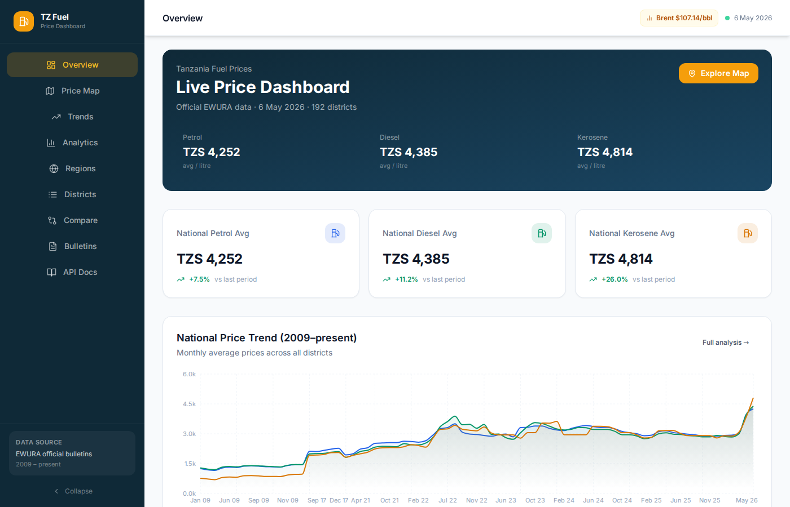
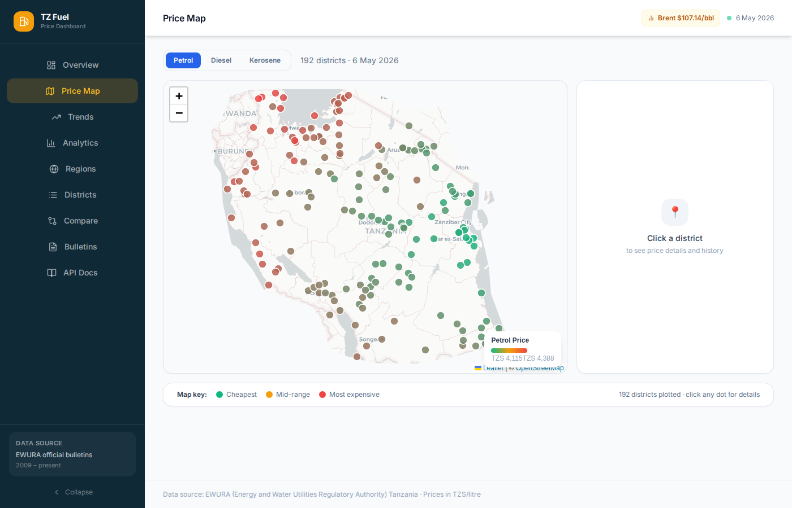
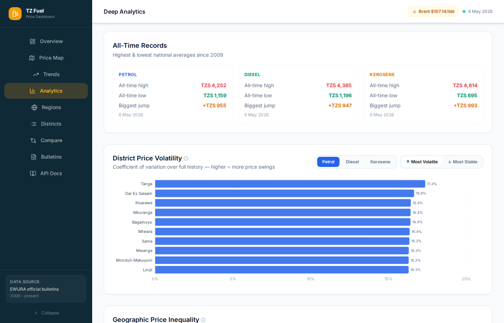
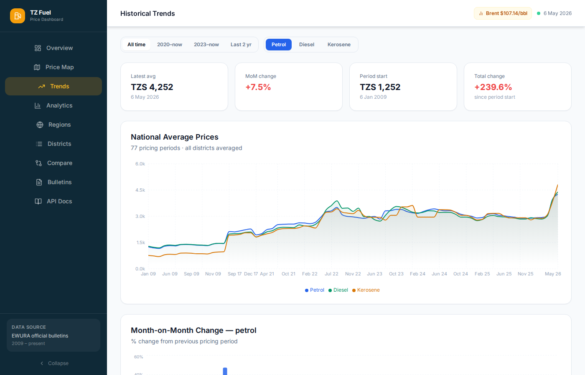
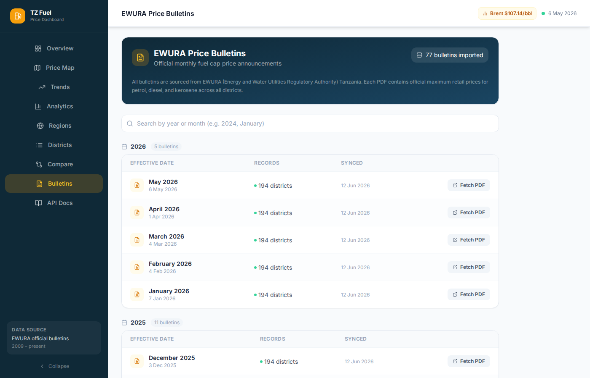
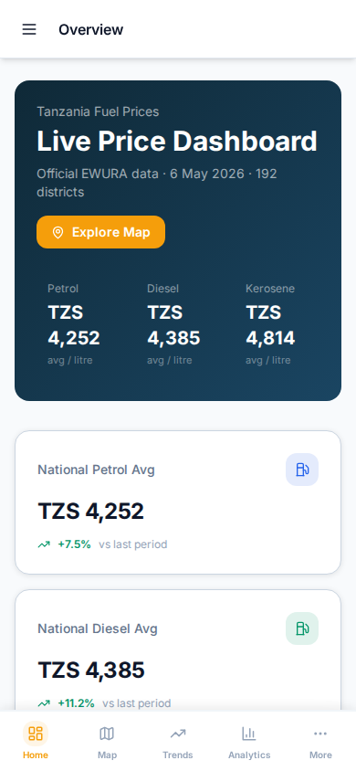

# TZ Fuel Price Dashboard

A live, data-rich dashboard for Tanzania's official fuel prices — sourced directly from EWURA's monthly PDF bulletins. Built with React, Vite, and Tailwind CSS.

Live at **[fuel.mahembega.com](https://fuel.mahembega.com)**

---

## Screenshots

| Overview | Price Map |
|---|---|
|  |  |

| Deep Analytics | Historical Trends |
|---|---|
|  |  |

| EWURA Bulletins | Mobile |
|---|---|
|  |  |

---

## Pages

| Route | Description |
|---|---|
| `/` | Overview — national averages, latest prices, full-history trend chart |
| `/map` | Interactive Tanzania district choropleth — toggle petrol/diesel/kerosene, click for history |
| `/trends` | Area/line charts with full 2009–present history and date range selector |
| `/analytics` | Deep analytics — volatility, regional gap, inflation index, Brent correlation, multi-model forecast |
| `/regions` | Regional breakdown with per-region averages and district drilldown |
| `/districts` | Searchable/sortable full district table with mini sparklines |
| `/compare` | Side-by-side district comparison (up to 3) with overlaid price history |
| `/bulletins` | EWURA PDF bulletin library — all 80+ monthly bulletins, stored and readable |
| `/docs` | Live API documentation |

---

## Features

- **Live Brent crude badge** — latest oil price displayed in the top bar
- **Tanzania-clipped map** — inverted mask showing only Tanzania, neighboring countries hidden
- **Collapsible sidebar** — desktop sidebar collapses to icon-only mode, preference saved to localStorage
- **Multi-model forecasting display** — shows which model was selected (Holt-Winters ETS / ARIMA / SARIMA / SARIMAX-X) and its AIC
- **Brent ↔ Tanzania correlation** — Pearson r correlation computed client-side for petrol/diesel/kerosene
- **Info tooltips** — hover explanations for technical terms (volatility, CAGR, R², etc.)
- **PDF bulletin viewer** — opens PDFs served from our own API (no EWURA URL dependency)
- **Fully responsive** — mobile-first layout with bottom tab navigation and safe-area support

---

## Tech Stack

- **React 18** + **TypeScript**
- **Vite** — build tool
- **Tailwind CSS** — utility-first styling
- **TanStack Query v5** — data fetching with caching
- **React Router v6** — client-side routing
- **Recharts** — time-series and bar charts
- **React-Leaflet** + **Leaflet** — interactive map
- **Lucide React** — icons

---

## Local Development

```bash
git clone https://github.com/jhembe/tz-fuel-ui.git && cd tz-fuel-ui
npm install
npm run dev
# → http://localhost:5173
```

By default the app calls `/api` (proxied to wherever your API is running).  
For production, set `VITE_API_URL` in `.env.production`:

```env
VITE_API_URL=https://fuelapi.mahembega.com/api
```

### Build

```bash
npm run build
# Output: dist/ — serve as static files
```

---

## Design System

| Token | Value |
|---|---|
| Sidebar background | `#0f2937` |
| Accent / brand | `#f59e0b` (amber) |
| Petrol | `#2563eb` (blue) |
| Diesel | `#059669` (emerald) |
| Kerosene | `#d97706` (amber-600) |
| Font | Inter |
| Cards | `bg-white rounded-2xl shadow-sm border border-slate-200 p-6` |

---

## Data Source

All prices are sourced from **EWURA** (Energy and Water Utilities Regulatory Authority), Tanzania's official energy regulator. Prices are the official maximum retail cap prices published monthly.

API: **[fuelapi.mahembega.com](https://fuelapi.mahembega.com)** — [GitHub](https://github.com/jhembe/tz-fuel-api)

---

## License

MIT
